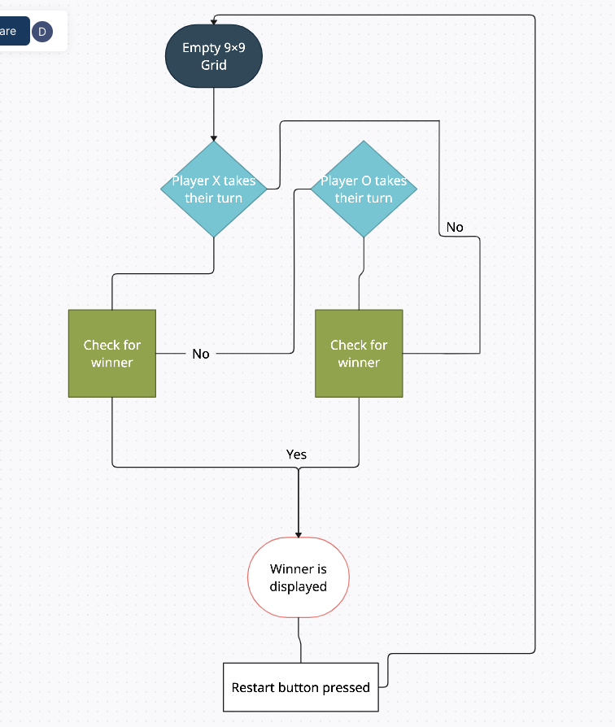

# Tic-Tac-Toe
SEI Project 1:

Tic Tac Toe is a fun game played between two people taking in turns to try and place their symbol three spots in a row.

## [Click Here](https://antalthomas.github.io/Tic-Tac-Toe/) to see my live project!

## How to play
- Click the link above.
- Player "X" goes first then player "O".
- Take in turns clicking on the grid.
- First player to have their three of their symbol line up WINS!.
- Restart at anytime or after somebody has won by clicking the restart button. ***Coming Soon***

## Initial Plan
1. Create a 9x9 grid with a header.
2. Have the eventListener add text to grid when clicked individually.
3. Have the eventListener cycle through "X" & "O" (taking turns) when clicking.
4. Winner is awarded from an array of predefined positions for either "X" or "O".
5. Winner window is shown once a winner has been awarded.
6. Restart button reloads window.

## Extra Plan
1. Add three themes to pick from at any time at the top left corner of screen.
2. Restart button doesn't refresh the page it just resets the game board.
3. Scores are kept for each player.
4. Player chooses symbols before game starts.

## Struggles:
I really struggled with making the event handler take it in turns with applying either a "X" or "O", so for a work around until I figured out how to do that, I just made the user cycle through the options with a click. I eventually found help on stack overflow with a similar problem that helped me.

## Bugs to Fix
- Restart refreshes the page instead of resetting everything.
- When a player has won the players can still click on blank cells.
- Make prettier.
- Improve code readability.

## Future Features
- Next game button after winner is awarded.
- Keep scores between players.
- Player chosen symbol.
- Different themes that can be chosen at any time.

## Sources used:
https://stackoverflow.com/questions/70950898/how-can-i-turn-these-two-functions-into-a-turn-by-turn-for-naughts-and-crosses

https://www.w3schools.com/css/css_align.asp

https://www.w3schools.com/jsref/prop_style_visibility.asp

https://www.markdownguide.org/cheat-sheet/

https://gist.git.generalassemb.ly/kasun/24d22950b4e29cd275f3e62bc77ccaa1

https://stackoverflow.com/questions/29884654/button-that-refreshes-the-page-on-click

https://www.w3schools.com/jsref/met_element_remove.asp